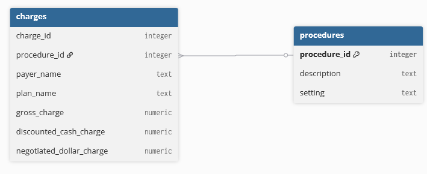

# Pick & Profile A Data Source
I have selected the hospital pricing transparency file from the hospital that I was born at. This selection was made to illustrate my ability to work with hospital pricing data given it's relevance to your product. The hospital pricing transparency requirements from CMS can be found here: https://www.cms.gov/files/document/august-11-2021-hospital-price-transparency-odf-slide-presentation.pdf. I found the specific data being ingested and analyzed in this project here: https://hospitalpricingfiles.org/details/a37eb62f-b584-41ee-87b6-e85de2faee70.

# Design a SQLite Schema
